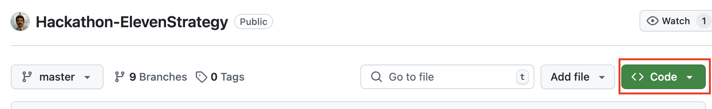
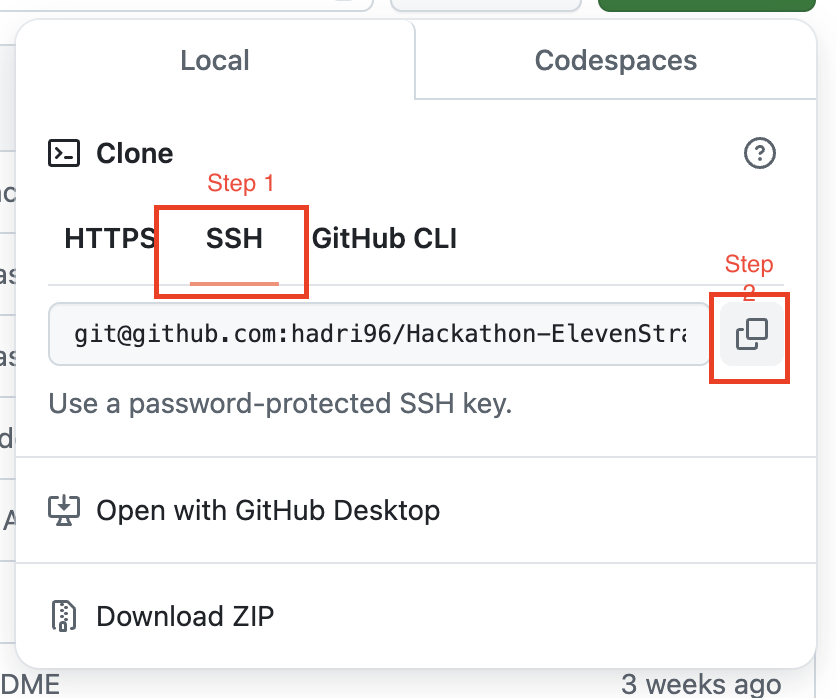
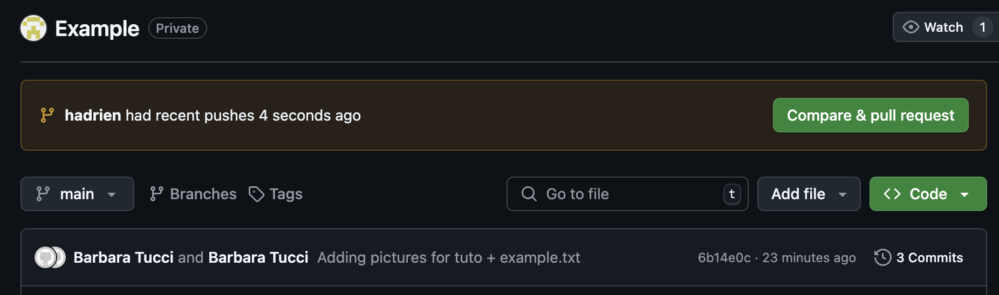
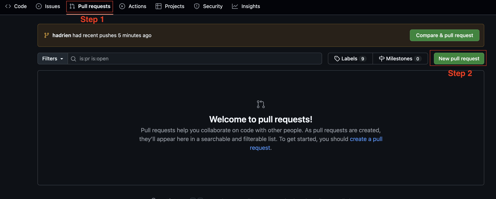
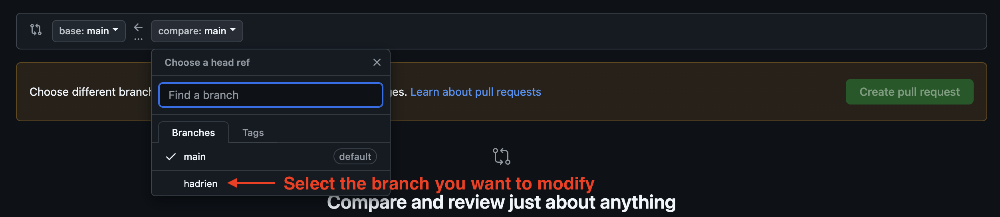
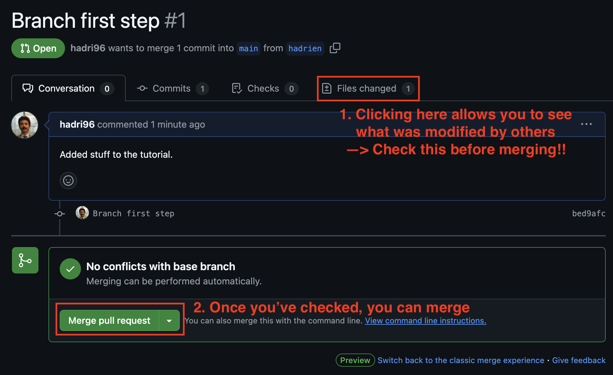
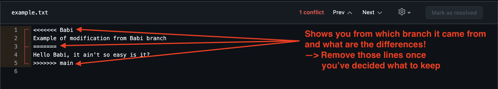
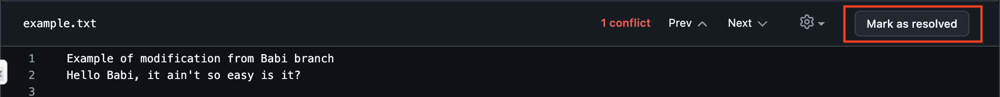
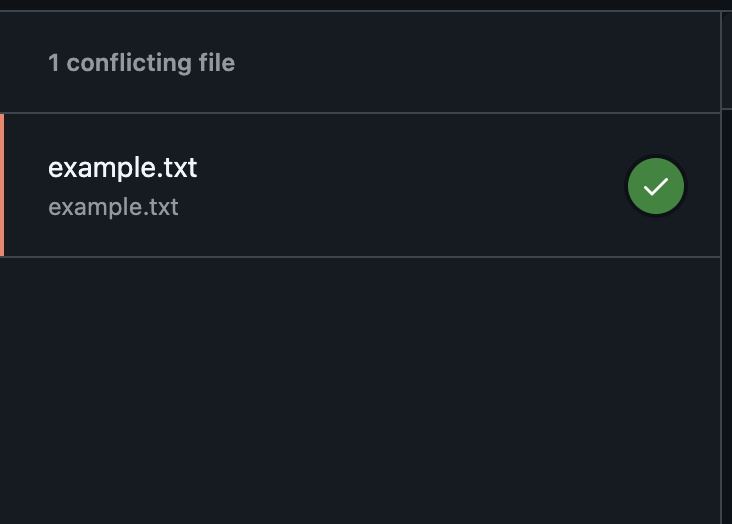
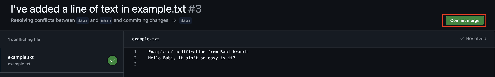

# Set-up 🚀

## Brew install 🍺

Package manager to be able to install `git` and `gh` (github command line tools)

```bash
/bin/bash -c "$(curl -fsSL https://raw.githubusercontent.com/Homebrew/install/HEAD/install.sh)"
```

## Install git and gh command line tools

```bash
brew install git gh
```

## Sign up on github (go the website) 📝

## Authenticate your laptop with github (this will link your laptop to your github account) 🔐

```bash
gh auth login
```

You're now ready to use Github! 🎉

## Using Github 💻

## Setting up a Github repository 📁

### Creating a new repo ✨

```bash
gh repo create
```

A few important things about the repository creation:
- **visibility**: allows you to decide whether other people can see your repository. A **public** repo is visible by anyone on github whereas a **private** repository is only visible by you and your teammates.
- **README.md**: a Markdown file that can be used to describe your project and explain how to use it to others. Usually a good practice to have one.
- **.gitignore**: a hidden file that allows you to prevent files to be updated to github. Usually, you will put the names of files that shouldn't be shared (with authentication information or if files are too large (GH only allows 100 MB maximum)). Github provides templates for each language so you can pick the right template when you start a project.
- **license**: this is not so important but it just protects you if you are worried that your code will be reused by others. Again, github provides templates of various licenses.

### Getting an already existing repository 📥

Go on the repository of interest on github.com and click on the code button



Select the SSH protocol and copy the url



Then clone the repository locally

```bash
git clone git@github.com:hadri96/Hackathon-ElevenStrategy.git
```

Congrats, you're now ready to contribute! 🎊

## Contributing to a repository 🤝

### Working alone 👨‍💻

To add a file you need to perform 3 commands:

**Step 1**: add ➕
```bash
git add <name_of_file>
```

This step is a preparation before committing a change.

**Step 2**: commit the change 💾

```bash
git commit -m "<message>"
```

The `<message>` is a small description of what you did to let your team mates understand what you've done.

When you commit a change becomes permanent **locally** (people online don't see it).

**Step 3**: push the change to github 🚀

```bash
git push origin <branch_name >
```


If you use oh-my-zsh, you will see the branch name on your terminal. If not, you can set oh-my-zsh by copy-pasting the command on the following website [link](https://ohmyz.sh/).

#### Tip 💡

If you want to add all the modified files in your repository, you can use this for step 1

```bash
git add .
```

⚠️ Be **very careful** with this, it may change things you do not want to update! ⚠️

#### Tip 💡

To see what has been modified you can use the following command:

```bash
git status
```

### Working with others 👥

To work with others, you're going to have to create **branches**. These branches are like parallel universes 🌌 that you can create and that contain a specific version of your project.

#### ⚠️ Why you should never work on the main/master branch when collaborating with others! ⚠️

The main/master branch should always be considered the "production" version of your code - the stable, working version that everyone can rely on. Here's why you should never work directly on it:

1. **Risk of breaking the code**: If you make changes directly on main and something goes wrong, you could break the code for everyone else
2. **Loss of code review**: Working on main bypasses the pull request process, which means your code isn't reviewed by others
3. **Difficulty tracking changes**: When multiple people work directly on main, it becomes hard to track who made what changes and why
4. **No easy rollback**: If something goes wrong, it's much harder to undo changes when they're made directly on main

Always create a new branch for your work, even if you're working alone. This keeps your main branch clean and stable! 🛡️

#### Creating a branch 🌿

To create a new branch and go on it, use the following command:

```bash
git checkout -b <branch_name>
```


#### Merging your branch to the main branch 🔄

1. Add the modified files by following the same steps as before!

2. Do a pull request on Github:



If this doesn't pop up on your repository go into the Pull Requests tab and click on **New pull request**



To be able to do a pull request, you'll have to select which branch you'd like to merge with the main branch by selecting it in the dropdown:



Then click on **Create a pull request**

Your team members will have to review your work



Once the branch has been merged to the main branch, you just have to pull the changes on your laptop.

To do that you need to first go back the main branch:

```bash
# This command allows you to navigate between existing branches at will!
git switch <branch_destination>

# Then pull the new changes to your desktop:
git pull origin main
```
You've now completed a full cycle! 🎯
##### Tip 💡
To see the available branches on your desktop:

```bash
git branch
```

This will open a menu with the branches that are available locally! To exit the menu, press q.

### What if two people modify the same file? 😱

This will create a conflict that will have to be resolved when you validate the pull request! 🔨

When you click on **Resolve conflicts**, it will open a merge editor that will highlight which parts of your files are resulting in the conflict as shown below:



Once the conflict is resolved, you will have to click on the button **Mark as resolved**



Once all the files have the green check:



You'll have to commit the merge resolution to github:



Congrats! You've now solved the conflict and are ready to move on and work on github projects! 🎉

## Additional tips 💫

### Working on a branch which is not your own! 🤝

Let's say, you're done with your work and you want to support a teammate who isn't done yet. His code is not available on main but you still want to be able to help him.

&rarr; His branch is **<font color='red'>not available on your laptop</font>**! To be able to help him you need to **fetch** his branch to have it available on laptop!

You can do it by doing the following command:

```bash
# Get the branch of your teammate
git fetch origin <branch_of_your_teammate>

# Switch to his/her branch
git switch <branch_of_your_teammate>
```

### Best Practices 👌

#### Commit Messages
- Use present tense ("Add feature" not "Added feature")
- Be brief but descriptive
- Start with a verb
- Example: "Add user authentication to login page"

#### Branch Naming
- Use descriptive names
- Include issue number if applicable
- Examples:
  - `feature/user-auth`
  - `bugfix/issue-123`
  - `hotfix/login-crash`

#### Pull Request Etiquette
- Keep changes focused and small
- Add descriptive title and description
- Link related issues
- Add screenshots for UI changes

### Troubleshooting Common Issues 🔧

#### Authentication Issues when cloning/pushing
➡️ If you're having trouble with authentication:
1. Make sure you're logged in with GitHub CLI:
```bash
# Check authentication status
gh auth status

# If not authenticated, login again
gh auth login
```
2. Follow the interactive prompts:
   - Choose SSH as protocol
   - Choose to Authenticate Git with your GitHub credentials
   - Log in with your browser when prompted

#### "Failed to push some refs"
➡️ Your local branch is behind remote. Try:
```bash
git pull origin main
# Then try pushing again
git push origin <branch-name>
```

#### "Fatal: refusing to merge unrelated histories"
➡️ Use:
```bash
git pull origin main --allow-unrelated-histories
```

#### Need to undo last commit?
➡️ Use:
```bash
# Undo commit but keep changes staged
git reset --soft HEAD~1

# Undo commit and unstage changes
git reset HEAD~1

# Undo commit and delete changes (⚠️ be careful!)
git reset --hard HEAD~1
```

#### Accidentally committed to wrong branch?
➡️ You can fix this with:
```bash
# Save your current changes
git stash

# Switch to correct branch
git checkout correct-branch

# Apply your changes
git stash pop

# Fix the other branch
git checkout wrong-branch
git reset HEAD~1
```
